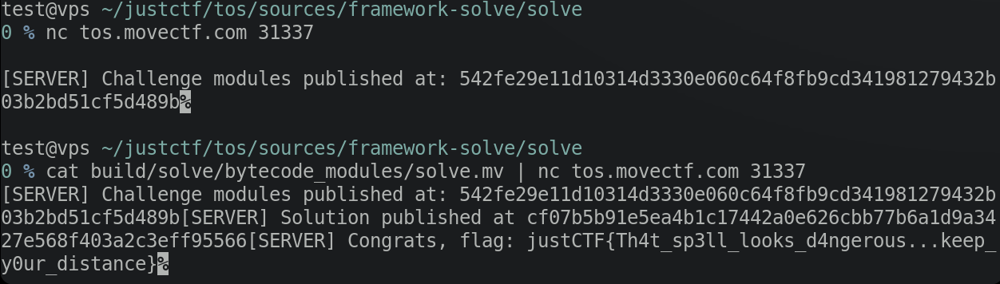

# The Otter Scrolls

https://2024.justctf.team/challenges/11    

由于比赛结束后服务器已经关了，我又想学习下比赛平台，所以自己把比赛环境搭了起来.   
小伙伴们可以直接使用



像我一样的新手可以试试，体验下拿flag的感觉😁

## 部署题目

实测至少需要买一台2核4G 、硬盘25G的vps

1.安装docker和compose

https://docs.docker.com/engine/install/debian/   
https://docs.docker.com/compose/install/linux/

2.拉取镜像   
https://hub.docker.com/r/embe221ed/otter_template/tags
sha256:1868755b24d06342766c54dd6e0516f41b62cec1e992a036f77a0b0401476a04   
下载需要大概16G磁盘空间
```
docker pull embe221ed/otter_template:latest
```

3.解开tos_docker.tar.gz并修改docker-compose.yml (非必须)

在本地测试时，我改了两个地方:  
- 添加flag
- 把服务端口改成了127.0.0.1:31337
```
services:
  tos:
    environment:
      FLAG: justCTF{Th4t_sp3ll_looks_d4ngerous...keep_y0ur_distance}
      PORT: 31337
    build:
      context: ./
      dockerfile: ./Dockerfile
    ports:
      - "127.0.0.1:31337:31337"
    restart: always
```
4.最后执行docker compose up 或者 docker compose up -d即可

## 解题

首先进入解题框架，把题目的地址(nc连接服务器获得)填入`dependency/Move.toml`
```
test@vps ~/justctf/tos/sources/framework-solve
0 % ls
Cargo.lock  Cargo.toml	dependency  solve  src

test@vps ~/justctf/tos/sources/framework-solve
0 % nc tos.movectf.com 31337

[SERVER] Challenge modules published at: 542fe29e11d10314d3330e060c64f8fb9cd341981279432b03b2bd51cf5d489b%                                                                          

test@vps ~/justctf/tos/sources/framework-solve
0 % cat dependency/Move.toml
[package]
name = "challenge"
version = "0.0.1"
edition = "2024.beta"

[dependencies]
Sui = { git = "https://github.com/MystenLabs/sui.git", subdir = "crates/sui-framework/packages/sui-framework", rev = "devnet-v1.27.0" }

[addresses]
admin = "0xfccc9a421bbb13c1a66a1aa98f0ad75029ede94857779c6915b44f94068b921e"
#challenge = "<ENTER ADDRESS OF THE PUBLISHED CHALLENGE MODULE HERE>"
challenge = "0x542fe29e11d10314d3330e060c64f8fb9cd341981279432b03b2bd51cf5d489b"
```
然后编写solve
```
test@vps ~/justctf/tos/sources/framework-solve
0 % ls solve
build  Move.lock  Move.toml  sources

test@vps ~/justctf/tos/sources/framework-solve
0 % cat solve/sources/solve.move
module solve::solve {

    // [*] Import dependencies
    use challenge::theotterscrolls;

    public fun solve(
        _spellbook: &mut theotterscrolls::Spellbook,
        _ctx: &mut TxContext
    ) {
        // Your code here...
        theotterscrolls::cast_spell(vector[1, 0, 3, 3, 3], _spellbook);
    }

}
```
这道题目的代码只需要插入一行
```
        theotterscrolls::cast_spell(vector[1, 0, 3, 3, 3], _spellbook);
```
然后执行build，把编译后的字节码发送到服务器就能得到flag了
```
test@vps ~/justctf/tos/sources/framework-solve
0 % cd solve

test@vps ~/justctf/tos/sources/framework-solve/solve
0 % sui move build
INCLUDING DEPENDENCY challenge
INCLUDING DEPENDENCY Sui
INCLUDING DEPENDENCY MoveStdlib
BUILDING solve

test@vps ~/justctf/tos/sources/framework-solve/solve
0 % cat build/solve/bytecode_modules/solve.mv | nc tos.movectf.com 31337
[SERVER] Challenge modules published at: 542fe29e11d10314d3330e060c64f8fb9cd341981279432b03b2bd51cf5d489b[SERVER] Solution published at cf07b5b91e5ea4b1c17442a0e626cbb77b6a1d9a3427e568f403a2c3eff95566[SERVER] Congrats, flag: justCTF{Th4t_sp3ll_looks_d4ngerous...keep_y0ur_distance}%
```
